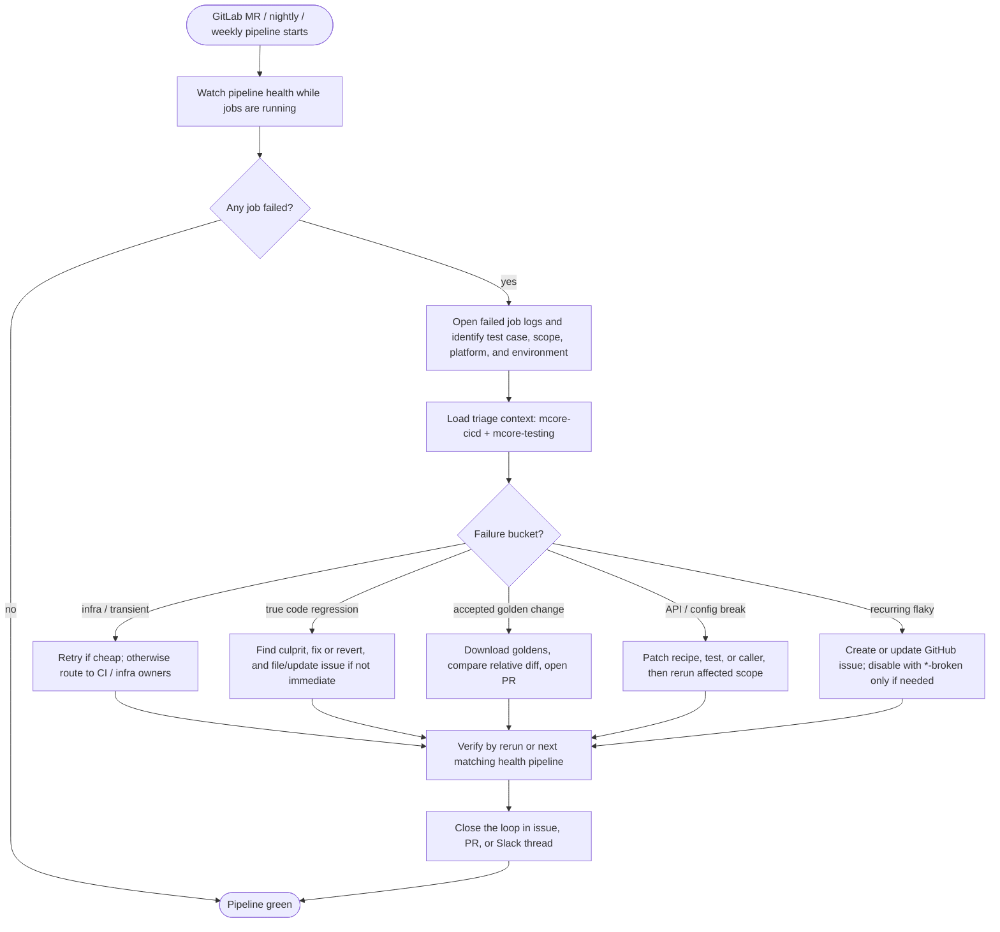

<!---
   Copyright (c) 2026, NVIDIA CORPORATION. All rights reserved.
   NVIDIA CORPORATION and its licensors retain all intellectual property
   and proprietary rights in and to this software, related documentation
   and any modifications thereto. Any use, reproduction, disclosure or
   distribution of this software and related documentation without an express
   license agreement from NVIDIA CORPORATION is strictly prohibited.
-->

# CI Healthiness Runbook

This runbook is for maintainers tracking Megatron-LM functional CI health.
The `mr`, `nightly`, and `weekly` health runs are GitLab pipelines, not GitHub
Actions runs.

## Process Flow



The rotation owns the failure until it is either fixed, reverted, accepted with
updated goldens, routed to the right owner with a GitHub issue, or confirmed as
infrastructure noise. Do not wait for the next scheduled run when a targeted
rerun is available.

## Prerequisites

- Access to `gitlab-master.nvidia.com/ADLR/megatron-lm` and the downstream
  functional pipeline jobs it triggers.
- Membership in `#megatron-core-pipeline-alerts-main` for health notifications
  and CI dashboard links.
- A GitLab token with API access when downloading GitLab golden values. Set it
  as `RO_API_TOKEN`; do not commit it or paste it into tracked files.
- A local Megatron-LM checkout with this repository on `PYTHONPATH` for parser
  and helper scripts.
- GitHub CLI access to `NVIDIA/Megatron-LM` when creating or updating tracking
  issues.

## Reference Runs

- MR: [pipeline 57433902](https://gitlab-master.nvidia.com/ADLR/megatron-lm/-/pipelines/57433902)
- Nightly: [pipelines on `ci-nightly`](https://gitlab-master.nvidia.com/ADLR/megatron-lm/-/pipelines?page=1&scope=all&ref=ci-nightly)
- Weekly: [pipelines on `ci-weekly`](https://gitlab-master.nvidia.com/ADLR/megatron-lm/-/pipelines?page=1&scope=all&ref=ci-weekly)

Use GitHub Actions only for GitHub PR validation and artifacts. Do not use it
as the source of truth for the GitLab `mr`, `nightly`, or `weekly` health runs.

## Health Pipelines

The health runs are selected by GitLab scope and branch/ref, not by GitHub
Actions labels. The examples above map to the three operational views:

| Run type | Where to look | What to check |
|---|---|---|
| MR | A specific GitLab pipeline, such as pipeline `57433902` | Regressions introduced by the candidate merge request |
| Nightly | Latest pipelines on ref `ci-nightly` | Daily coverage and regressions that escaped PR scope |
| Weekly | Latest pipelines on ref `ci-weekly` | Broader weekly coverage, heavier tests, and long-tail regressions |

A single parent pipeline can trigger multiple functional child pipelines by
platform and environment. When reporting a failure, link both the parent
pipeline and the failing child job whenever both are available.

## Monitoring

Monitor `#megatron-core-pipeline-alerts-main` and the GitLab pipeline pages
directly. Long-running jobs can fail before the full pipeline finishes, so check
the active pipeline instead of waiting only for an end-of-run notification.

To find the relevant run:

1. Open the MR, nightly, or weekly GitLab pipeline from the links above.
2. Filter or scan for failed functional/downstream jobs under the functional stages.
3. Open each failed job and capture the job URL, job name, status, scope,
   platform, environment, and first useful error.
4. If artifacts exist, prefer rank-0/stdout logs first, then inspect per-rank
   logs only as needed.

Keep a short triage note while investigating. It should name the failed test,
current bucket, owner, next action, and the link that proves the current state.

## Scope Labels

Recipe scopes are defined in `tests/test_utils/recipes/**/*.yaml` and are
matched by `tests/test_utils/python_scripts/recipe_parser.py`.

| Scope | Used by |
|---|---|
| `mr` | GitLab MR functional runs |
| `mr-slim` | GitLab slim MR functional subset |
| `mr-github` | GitHub PR functional runs |
| `mr-github-slim` | GitHub default slim PR subset |
| `nightly` | GitLab nightly functional runs |
| `weekly` | GitLab weekly functional runs |
| `unit-tests` | GitLab unit-test recipe buckets |
| `smoke` | GitLab lightweight smoke recipes |

Disabled recipe rows keep their scope with a suffix such as `mr-broken`,
`mr-github-broken`, or `nightly-broken`. Leave those entries in the recipe so
the disabled test remains discoverable.

## Triage Steps

Start from the failing GitLab pipeline or job URL. Do not assume the failure is
a golden-value update until the logs show what moved and why.

1. **Identify the failing workload.** Record the GitLab pipeline, job, scope,
   platform, environment, model, test case, and recipe path.
2. **Load context.** Use `mcore-cicd` for pipeline layout and `mcore-testing`
   for recipe, test, and golden-value layout.
3. **Read the first meaningful failure.** Start with rank 0 or stdout, then
   inspect per-rank logs if the root cause is not visible.
4. **Classify the bucket.** Use the table below and avoid updating goldens
   until the failure is clearly an accepted metric change.
5. **Assign an owner.** Use CODEOWNERS, last-touch author, recipe maintainer,
   or the relevant subsystem owner. The rotation still owns follow-through.
6. **Choose the action.** Retry, fix, revert, update goldens, or create/update
   a GitHub issue.
7. **Verify.** Rerun the affected job/scope where possible, or watch the next
   matching health pipeline.

Use the skills as working context when triaging with Codex:

| Situation | Skill to invoke | What it should provide |
|---|---|---|
| Finding logs, understanding pipeline scope, or checking PR labels | `mcore-cicd` | CI layout, scope labels, log and artifact locations, and trigger cautions |
| Mapping a failing job to recipe YAML, test case files, or disabled scopes | `mcore-testing` | Recipe layout, golden-value paths, and local reproduction notes |
| Accepting new golden values or summarizing metric drift | `update-golden-values` | Download command pattern and relative-difference summary workflow |
| Filing a GitHub issue for a GitHub Actions job | `mcore-create-issue` | Failure-log extraction, duplicate search, issue body, and assignee lookup |

For GitLab health failures, `mcore-create-issue` is still useful as an issue
template reference, but its automated workflow expects a GitHub Actions run or
job URL. For GitLab jobs, create the issue manually using the fields in
[Creating GitHub Issues](#creating-github-issues).

## Failure Buckets

| Bucket | Signals | Resolution |
|---|---|---|
| Infra or transient failure | NCCL timeout, cluster issue, missing artifact, runner failure, network or data download failure | Retry if cheap; otherwise route to CI or infra owners with pipeline and job links |
| Golden-values regression, true break | Loss, `num-zeros`, memory, or timing moved unexpectedly and correlates with a code change | Find the responsible commit, then fix or revert. Do not update goldens |
| Golden-values regression, accepted change | Expected numerical, memory, or timing change from an intentional model, test, or hardware update | Update golden values from the clean run and include a relative-diff summary |
| API or config break | Import error, argument error, renamed field, missing dependency, invalid recipe field | Fix the caller, recipe, or test, then re-run the affected scope |
| Repeated flaky test | Same test fails intermittently without a clear product regression | File or update a GitHub issue, keep the recipe row discoverable, and use `*-broken` only when the test must be disabled |

When disabling a functional recipe row, suffix the scope rather than deleting
the row, for example `scope: [mr]` -> `scope: [mr-broken]`.

## Ownership

The `mcore-oncall` / CI-health rotation owns first-pass triage for nightly and
weekly CI errors, as described in `docs/developer/oncall.md`. That means the
rotation is responsible for finding the bucket, routing to an owner, and keeping
the issue moving. It does not mean the rotation must be the final code owner for
every fix.

| Failure area | First routing target |
|---|---|
| Test or recipe behavior | Last-touch author for the test case or recipe, plus relevant CODEOWNERS group |
| Megatron Core library regression | CODEOWNERS group for the changed subsystem |
| Golden-value accepted change | Author or owner of the PR/change that intentionally moved the metric |
| CI plumbing, runner, cluster, data, or artifact issue | CI/infra owners; include pipeline and job links |
| Unclear recurring failure | Open a GitHub issue and tag `@NVIDIA/mcore-oncall` |

Useful owner lookup commands:

```bash
git log -1 --format="%an <%ae> %h" -- \
  tests/functional_tests/test_cases/<model>/<test_case>

git log -1 --format="%an <%ae> %h" -- \
  tests/test_utils/recipes/<platform>/<recipe>.yaml

rg -n "<changed-path-or-directory>" .github/CODEOWNERS
```

If a failure is severe and there is no quick fix, revert the breaking change or
disable the specific recipe scope with a linked tracking issue. Do not leave a
known red health run without an owner and next action.

## Handling a Failure

For a code regression, identify the introducing change before accepting new
goldens. Start with the triggering branch/commit range from the GitLab pipeline,
then inspect recently merged PRs touching the failing model, distributed path,
optimizer, data path, recipe, or test case.

Use these resolution rules:

1. **Quick fix** when the patch is small and the owner can validate it quickly.
2. **Revert** when the break is severe, broad, or not fixable in the current
   rotation window.
3. **Golden update** only when the new values are correct and expected.
4. **Issue + temporary disable** only when the failure needs tracking and blocks
   health, and only by changing the relevant scope to a `*-broken` scope.

Every resolution needs verification: a targeted rerun, a clean follow-up
pipeline, or a clear owner acknowledgment with a linked issue.

## Golden Values

Only update golden values after the failure has been classified as an accepted
change. Do not refresh goldens for infra failures, unknown regressions, or a
metric move that still needs owner review.

Use the `update-golden-values` skill for the refresh and summary. The skill
owns the artifact download, relative-difference comparison, and PR-ready
summary; the oncall owns deciding whether the update is legitimate.

When invoking the skill, provide these inputs:

| Input | What to provide |
|---|---|
| Run identity | GitLab pipeline URL/ID for health runs, or GitHub Actions workflow run URL/ID for PR validation runs |
| Source | `gitlab` for MR/nightly/weekly health runs; `github` for GitHub Actions PR validation |
| Scope | `only-failing` for normal triage; `all` only for an intentional full refresh from a clean run |
| Prior edits | Say whether existing golden-value edits should be reset before refreshing or layered into the current branch |
| Reason | The accepted behavior change, owner acknowledgment, PR, or issue that justifies changing goldens |

For GitLab health runs, the skill needs GitLab access in the environment before
it can retrieve artifacts:

| Environment | Expected value |
|---|---|
| `GITLAB_ENDPOINT` | `gitlab-master.nvidia.com` |
| `RO_API_TOKEN` | A token that can read the GitLab pipeline artifacts |

The skill should return a reviewable summary with:

- The run source, pipeline/workflow ID, and whether it refreshed failing jobs
  only or all jobs.
- The number of golden-value files changed under
  `tests/functional_tests/test_cases/**/golden_values_*.json`.
- A relative-difference summary by metric, including the largest
  `lm loss`, `num-zeros`, memory, and iteration-time movements.
- Any rows that exceed the usual noise threshold and need owner review before
  commit.
- A short interpretation that can be pasted into the PR or issue.

Before committing a golden update, verify that only intended
`golden_values_*.json` files changed, the relative-difference summary was
reviewed, and no tokens, temporary environments, downloaded artifacts, or
scratch summaries are staged.

## Creating GitHub Issues

Create a GitHub issue when a failure cannot be fixed immediately, is recurring,
or needs tracking across health runs. Update an existing issue instead of
opening a duplicate.

Use the `mcore-create-issue` skill for GitHub Actions failures. Provide the run
or job URL and let the skill:

- Parse the run/job ID.
- Identify failed jobs when only a run URL is provided.
- Fetch the relevant log lines and keep the core error concise.
- Resolve the triggering PR when the run is tied to a pull request.
- Resolve the likely test owner from the failing file history when possible.
- Search open GitHub issues for duplicates before creating anything.
- Create a bug issue, assign the likely owner when available, and report the
  created or duplicate issue URL.

GitLab health failures come from GitLab MR, nightly, and weekly pipelines, so
there may not be a GitHub Actions URL for the skill to parse. In that case,
prepare the same failure packet and use the issue-creation workflow with those
fields instead of the GitHub Actions URL:

| Field | Notes |
|---|---|
| Pipeline | GitLab pipeline URL and numeric pipeline ID |
| Job | Failed GitLab job URL and job name |
| Scope | `mr`, `nightly`, `weekly`, `smoke`, or other recipe scope |
| Platform/environment | Example: `dgx_h100` + `dev`, `dgx_gb200` + `dev`, `dgx_a100` + `lts` |
| Test case | `<model>/<test_case>` and recipe file path |
| Failure bucket | One of the buckets above |
| Error | The first useful exception, assertion, or metric-drift summary, kept short |
| Owner signal | Last-touch author, CODEOWNERS group, or known area owner if available |
| Proposed action | `fix`, `revert`, `update goldens`, `retry`, or `investigate` |

Issue title guidance:

| Failure type | Title shape |
|---|---|
| Hard test failure | `CI health failure: <model>/<test_case>` |
| Speed, memory, or accuracy regression | `[REGRESSION] <model>/<test_case> <metric> regression` |
| Repeated infra-looking failure | `CI health flake: <model>/<test_case> <short symptom>` |

The issue body should follow the bug or regression template and include:

- A short description that names the failing test or recipe and tags
  `@NVIDIA/mcore-oncall`.
- Links to the failing GitLab pipeline and job, or the GitHub Actions run and
  job when the failure came from PR validation.
- The scope, platform, environment, recipe path, and failure bucket.
- The core error snippet, kept to roughly 30 lines or less, with the full log
  available from the linked job.
- The suspected owner or owner signal, if known.
- The proposed next action and any temporary disablement or golden-update
  follow-up.

For speed or accuracy regressions, use the regression issue template structure
from `.github/ISSUE_TEMPLATE/regression.md` and include previous/new metrics
from the golden-value comparison or job logs.

The expected result is either a newly created issue URL or an existing duplicate
issue URL, plus a short note describing what was filed or updated. Do not open a
new issue when an existing open issue already tracks the same failure.

## Closeout Checklist

- The failure bucket is recorded in the issue, PR, or Slack thread.
- If goldens changed, the `update-golden-values` skill summary was reviewed.
- If a test was disabled, the recipe row remains in place with a `*-broken`
  scope and a tracking issue is linked from the PR.
- A fix, revert, retry, or golden update has been verified by rerunning the
  affected job or scope, or by observing the next matching health pipeline.
- Any GitHub issue created for the failure links the GitLab pipeline and job.
